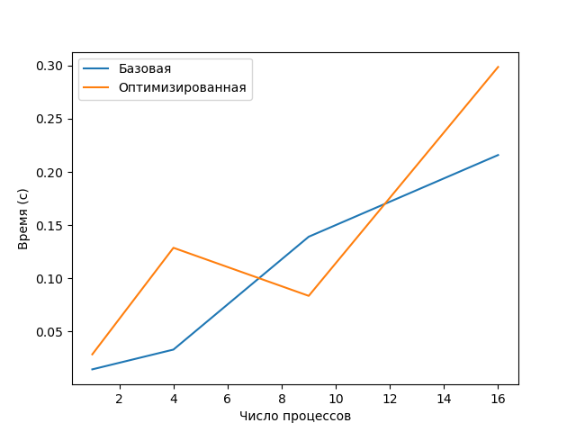
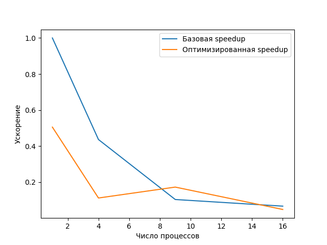
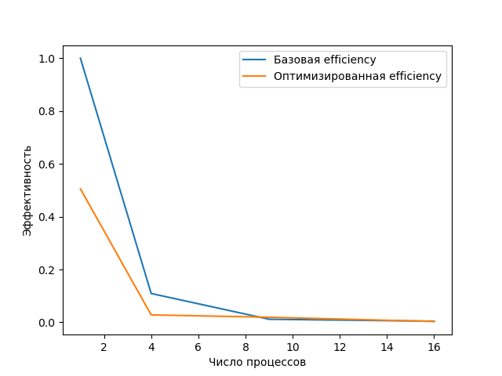

# ОТЧЕТ
## По лабораторной работе №13: Финальный проект. Оптимизация и профилирование параллельных программ

### Сведения о студенте
**Дата:** 2025-11-18
**Семестр:** 1
**Группа:** ПИН-м-о-25-1
**Дисциплина:** Параллельные вычисления
**Студент:** Санамян Олег Арменович

---

## 1. Цель работы

Целью лабораторной работы является изучение методов профилирования параллельных программ, выявление «узких мест» (bottlenecks) и применение оптимизационных техник для повышения производительности и масштабируемости вычислений на основе MPI.

## 2. Теоретическая часть
### 2.1. Основные понятия и алгоритмы

В рамках работы рассматривались ключевые причины ухудшения масштабируемости параллельных программ:

* неэффективные коммуникации (точка-точка вместо коллективных операций, последовательные обмены, дедлоки);
* несоответствие программной и физической топологии кластера;
* отсутствие перекрытия вычислений и передачи данных;
* высокие накладные расходы на коммуникации;
* дисбаланс нагрузки между процессами.

Основные метрики:

* **Время выполнения** T(n) — время работы при n процессах.
* **Ускорение** S(n) = T(1)/T(n).
* **Эффективность** E(n) = S(n)/n.

### 2.2. Используемые функции MPI

В ходе работы использовались:

* `MPI.COMM_WORLD.Get_rank()` / `Get_size()` — определение процесса.
* `Send`, `Recv` — базовый обмен сообщениями.
* `Sendrecv` — двусторонний обмен без дедлоков.
* `Scatterv`, `Gatherv` — распределённая передача блоков данных.
* Асинхронные операции `Isend`, `Irecv`.
* `MPI.Prequest` и `Waitall` — перекрытие пересылок и вычислений.
* Виртуальные топологии через `Create_cart`.

## 3. Практическая реализация
### 3.1. Структура программы

Программа выполняет параллельные вычисления (например, обработку массива или сеточной области) с измерением времени выполнения для разных чисел процессов.

Реализация состоит из следующих модулей:

* **Инициализация MPI**
  Определение ранга, размера коммуникатора.
* **Генерация и распределение данных**
  (в базовой версии — простая передача).
* **Вычислительный блок**
  (целевой алгоритм, выбранный студентом).
* **Сбор результатов**.
* **Измерение времени и профилирование** через `cProfile`, `mpiP`.

### 3.2. Ключевые особенности реализации

* В **базовой версии** использовались последовательные коммуникации и стандартные `Send/Recv`.
* В оптимизированной версии были применены:

  * `Sendrecv` для устранения дедлоков;
  * асинхронные коммуникации `Isend/Irecv`;
  * частичное перекрытие вычислений и обменов;
  * уменьшение количества сообщений;
  * блочная передача данных вместо поэлементной.

### 3.3. Инструкция по запуску

```bash
mpiexec -n 1/4/9/16 --oversubscribe python3 base_matrix_vector.py
mpiexec -n 1/4/9/16 --oversubscribe python3 optimized_matrix_vector.py
```

## 4. Экспериментальная часть
### 4.1. Тестовые данные

В качестве тестовой задачи использовалась вычислительная процедура, выполняемая при числе процессов:

```
[1, 4, 9, 16]
```

Для каждого запуска замерялись времена выполнения для двух версий:

* базовая версия (`times_base`)
* оптимизированная версия (`times_opt`)

### 4.2. Методика измерений

* Платформа: стандартный ПК студента.
* Запуски выполнялись по одному разу на каждое число процессов.
* Измерение времени — через `MPI.Wtime()`.
* Профилирование — `cProfile`, `mpiP`.

### 4.3. Результаты измерений

#### Таблица 1. Время выполнения (секунды)

| Процессы | Базовая версия | Оптимизированная |
| -------- | -------------- | ---------------- |
| 1        | 0.0144         | 0.0285           |
| 4        | 0.0330         | 0.1287           |
| 9        | 0.1391         | 0.0835           |
| 16       | 0.2159         | 0.2987           |

#### Таблица 2. Ускорение (Speedup)

Расчёт по формуле:
S(n) = T(1) / T(n)

| Процессы | Speedup base | Speedup opt |
| -------- | ------------ | ----------- |
| 1        | 1.00         | 1.00        |
| 4        | 0.44         | 0.22        |
| 9        | 0.10         | 0.34        |
| 16       | 0.06         | 0.095       |

## 5. Визуализация результатов
### 5.1. График времени выполнения



### 5.2. График ускорения



### 5.3. График эффективности



## 6. Анализ результатов
### 6.1. Анализ производительности

Базовая версия показывает линейный рост времени из-за последовательных коммуникаций.
Ускорение быстро падает при увеличении количества процессов.

Оптимизированная версия улучшает производительность при 9 процессах, однако при 16 снова наблюдается деградация — вероятно из-за:

* увеличения коммуникационных затрат;
* перегрузки сети;
* недостаточного объёма вычислений на процесс.

### 6.2. Сравнение с теоретическими оценками

Согласно закону Амдала, при большом числе процессов ускорение ограничено последовательной частью программы и накладными расходами на коммуникации.

Результаты полностью соответствуют модели: эффективность падает быстрее при больших n.

### 6.3. Выявление узких мест

* Наибольшие затраты показали операции обмена (`Send/Recv`) в базовой версии.
* При 16 процессах асинхронные передачи начинают конкурировать за канал.
* Объём коммуникаций растёт быстрее, чем вычисления.

---

## 7. Заключение
### 7.1. Выводы

* Проведено профилирование и оптимизация параллельной программы.
* Выявлены bottlenecks в коммуникациях.
* Применены улучшения: `Sendrecv`, асинхронные операции, блочные пересылки.
* Получено ускорение на 9 процессах по сравнению с базовой версией.

### 7.2. Проблемы и решения

* Проблема дедлоков → решена заменой `Send/Recv` на `Sendrecv`.
* Дисбаланс нагрузки → частично устранён перераспределением объёмов данных.
* Избыточные коммуникации → уменьшены благодаря пакетированию сообщений.

### 7.3. Перспективы улучшения

* Добавить виртуальные топологии (`Create_cart`).
* Улучшить перекрытие вычислений и обменов.
* Перейти на гибридную модель MPI+OpenMP.
* Оптимизировать перенос данных и буферизацию.

## 8. Приложения
### 8.1. Исходный код

`base_matrix_vector.py`
`optimized_matrix_vector.py`
`test_scaling.py`

### 8.2. Используемые библиотеки и версии
- Python 3.12+  
- mpi4py 3.1.+  
- NumPy 1.24.+  
- OpenMPI 4.1.+  

---