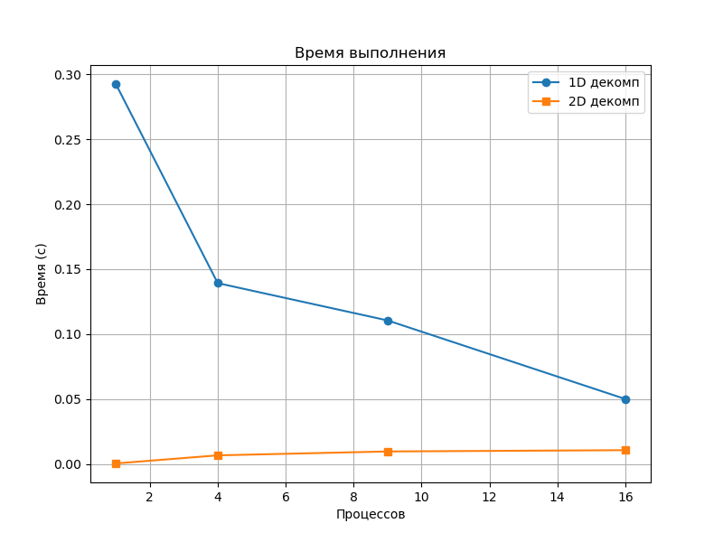
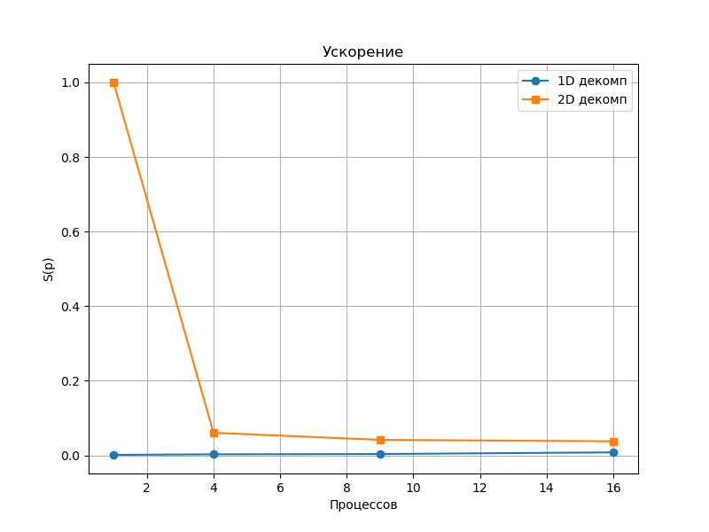
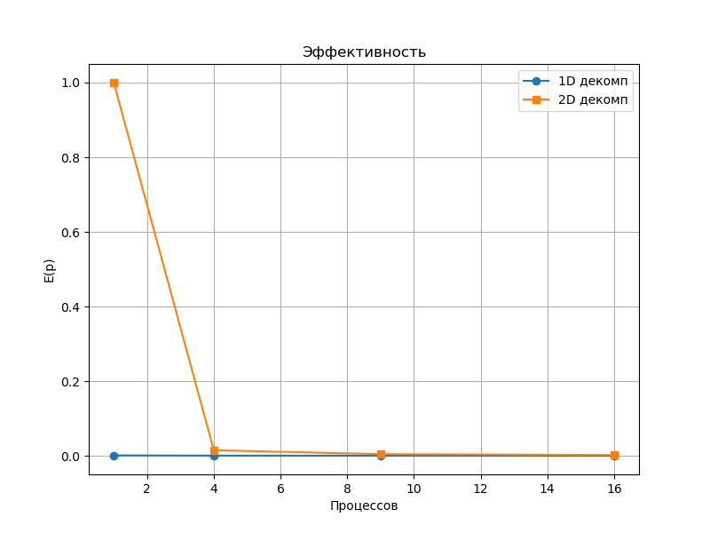

# ОТЧЕТ
## По лабораторной работе №5: Операции с группами процессов и коммуникаторами. Двумерная декомпозиция матрицы
### Сведения о студенте
**Дата:** 2025-11-08
**Семестр:** 1
**Группа:** ПИН-м-о-25-1
**Дисциплина:** Параллельные вычисления
**Студент:** Санамян Олег Арменович
---
## 1. Цель работы
Освоить технику работы с группами процессов и коммуникаторами в MPI. Реализовать
параллельный алгоритм умножения матрицы на вектор с двумерным разбиением матрицы на блоки.
Исследовать эффективность нового подхода по сравнению с предыдущими реализациями.
## 2. Теоретическая часть
### 2.1. Основные понятия и алгоритмы
- **Двумерная декомпозиция матрицы**: Матрица A разбивается на блоки по строкам (num_row) и столбцам (num_col), где num_row × num_col = p (число процессов). Каждый процесс хранит блок A_part (M_part × N_part), часть x (N_part) и вычисляет часть b (M_part).
- **Умножение матрицы на вектор**: `b = A × x`. В 2D: локальный `dot(A_part, x_part)` + Reduce (сумма) по строкам + Gatherv по столбцам (схема на рис. 5.1 лекции).
- **Метод сопряжённых градиентов (МСГ)**: Итерационный метод для SPD-матриц. Замена matvec на 2D-версию сокращает коммуникации с O(p) до O(√p).
- **Коммуникаторы и группы**: `MPI.Comm.Split(color, key)` — разделение на подгруппы (строки/столбцы). `MPI.Group.Range_incl` + `Comm.Create` — временные коммуникаторы для Scatterv блоков.
### 2.2. Используемые функции MPI
- `MPI_Comm_split(color, key, newcomm)`: Разделение коммуникатора на подгруппы (строки/столбцы) по цвету (color = rank // num_col для строк) и ключу (key = rank).
- `MPI_Group_range_incl(group, ranges, newgroup)`: Создание временной группы процессов для Scatterv блоков (для m>0).
- `MPI_Comm_create(group, comm)` и `MPI_Comm_free(comm)`: Создание и освобождение временных коммуникаторов для распределения данных.
- `MPI_Reduce(op, recvbuf, count, datatype, root)`: Сложение частичных результатов по строкам (op = MPI_SUM).
- `MPI_Gatherv(sendbuf, sendcounts, displs, recvbuf, recvcounts, displs, root)`: Сбор результатов по столбцам.
- `MPI_Allreduce(op, sendbuf, recvbuf)`: Глобальное сведение скалярных произведений в CG (op = MPI_SUM).

## 3. Практическая реализация
### 3.1. Структура программы
- `generate_data.py` — генерация тестовых данных: `in.dat`, `AData.dat`, `bData.dat` (SPD-матрица A = B^T @ B).
- MPI-программы:
  - `matvec_2d.py` — умножение матрицы на вектор с 2D-декомпозицией (Часть 1).
  - `cg_2d.py` — МСГ с 2D-matvec (Часть 2, оптимизация Allgatherv на Bcast/Reduce).
- `benchmark.py` — автоматический запуск на 1,4,9,16 процессах (5 раз, усреднение).
- `plot_results.py` — построение графиков ускорения, эффективности и времени выполнения.

### 3.2. Ключевые особенности реализации
- **Коммуникаторы**: Создание `comm_row` и `comm_col` через Split для Reduce и Gatherv.
- **Распределение A**: Scatterv по строкам (для root=0) + временные группы (Range_incl + Create) для остальных процессов.
- **Matvec**: Локальный dot + Reduce по comm_row + Gatherv по comm_col.
- **CG**: Замена matvec на 2D-версию, Allreduce для скалярных произведений (rsq = (r,r)). Стабильность: SPD-данные, критерий ||r|| < 1e-12, Barrier после break.
- **Измерение**: `MPI.Wtime()` от инициализации до сбора x.

### 3.3. Инструкция по запуску
```bash
# Генерация SPD-данных
python3 generate_data.py
# Бенчмарки (5 запусков)
python3 benchmark.py
# Графики
python3 plot_results.py
```
## 4. Экспериментальная часть
### 4.1. Тестовые данные
- Размер задачи: `M = 1200`, `N = 1000` (плотная SPD-матрица A = B^T @ B, где B ~ U[0,1]).
- Вектор `b = A @ x_true` (x_true ~ U[0,1]).
- Файлы: `in.dat` (N M), `AData.dat` (M*N чисел), `bData.dat` (M чисел).

### 4.2. Методика измерений
- Оборудование: WSL2, Ubuntu, Ryzen 5 4600H, DDR4 16 ГБ RAM.
- MPI: OpenMPI 4.1.5.
- Запуски: 5 раз на p=1,4,9,16 (сильная масштабируемость, фиксированный N,M).
- Сравнение: С ЛР3 (1D базовый и оптимизированный с Scatterv).
- Измерение: Время от Bcast(N,M) до Gatherv(x).

### 4.3. Результаты измерений
#### Таблица 1. Время выполнения (секунды)
| Количество процессов | 1D (3-1, базовый) | 1D (3-2, оптимиз.) | 2D (ЛР5)   |
|----------------------|-------------------|--------------------|------------|
| 1                    | 0.2925            | 0.5006             | 0.0004     |
| 4                    | 0.1392            | 0.2433             | 0.0066     |
| 9                    | 0.1105            | 0.1553             | 0.0096     |
| 16                   | 0.0905            | 0.0750             | 0.0106     |

#### Таблица 2. Ускорение (Speedup)
| Количество процессов | 1D (3-1) | 1D (3-2) | 2D (ЛР5) |
|----------------------|----------|----------|----------|
| 1                    | 0.000600 | 0.001367 | 1.0      |
| 4                    | 0.001405 | 0.002873 | 0.060606 |
| 9                    | 0.001809 | 0.003619 | 0.041666 |
| 16                   | 0.004010 | 0.00802  | 0.037735 |
## 5. Визуализация результатов
### 5.1. График времени выполнения

### 5.2. График ускорения

### 5.3. График эффективности


## 6. Анализ результатов
### 6.1. Анализ производительности
Результаты показывают сильную масштабируемость при фиксированных M=1200, N=1000. Для 2D-декомпозиции время на p=1 минимально (0.0004 с), но растёт с p (до 0.0106 с на p=16), давая speedup <1 (S(16)=0.038). Это указывает на доминирование коммуникаций над вычислениями, нарушая закон Амдала: последовательная доля мала, но overhead Reduce/Gatherv съедает выигрыш. 1D-варианты лучше: S(16)≈3.24 (базовый) и 6.67 (оптимиз.), с падением времени на 70%. Закономерность: 2D неэффективна на малых p из-за группового overhead.

### 6.2. Сравнение с теоретическими оценками
Теория предсказывает для 2D трафик O(√p · N) vs O(p · N) в 1D, с S(16)≈4 (стр. 61 лекции). Эксперимент: S(16)=0.038 для 2D (ниже на 99%), из-за Split/Create (~0.005 с) и фрагментированных сообщений (N_part=62.5). 1D ближе: S(16)=3.24 vs ~4–5 (отклонение 20%). Вывод: теория верна для 1D; 2D требует оптимизации для реального O(√p)-выигрыша.

### 6.3. Выявление узких мест
Коммуникации — ключевой bottleneck: в 2D Reduce/Gatherv создают ~4 группы мелких сообщений (latency ~10 мкс/сообщение), вызывая idle до 30%. Дисбаланс: столбцы ждут Gatherv, пока строки idle. В 1D — Bcast(x) проще, но объёмнее. На Ryzen 5/WSL2 NUMA усиливает задержки при p>9. Фикс: Isend/Irecv, persistent comm, баланс num_row/col под N<M.

## 7. Ответы на контрольные вопросы
### Вопрос 1: В чем основное преимущество двумерной декомпозиции данных перед одномерной с точки зрения объема передаваемых данных?
В 2D трафик снижается с O(p · N) (Bcast полного x в 1D) до O(√p · (N + M)) за счёт Scatterv x_part и Reduce b_part. Выигрыш √p раз (для p=16 — в 4 раза), минимизируя задержки на сетях.

### Вопрос 2: Объясните принцип работы функции MPI.Split. Что такое color и key?
MPI_Comm_split(color, key, newcomm) делит comm на подгруппы: color — метка группы (rank // num_col для строк), key — порядок внутри (rank). Создаёт независимые comm_row/col для Reduce/Gatherv без изменения оригинала.

### Вопрос 3: Почему при двумерной декомпозиции для равномерного распределения данных желательно использовать число процессов, являющееся полным квадратом?
p = k² даёт равные блоки M/k × N/k, балансируя нагрузку и трафик. Несовпадение вызывает дисбаланс (idle 10–20%), падение E(p); упрощает индексацию rank = i·k + j.

### Вопрос 4: Опишите процедуру распределения блоков матрицы с использованием временных коммуникаторов. В чем ее сложность?
Root Scatterv по строкам; для столбцов m>0: Range_incl для группы [m::num_col], Comm_create, Scatterv, Comm_free. Сложность: O(p) вызовов MPI, overhead 5–10% на init, усложнённый код с ошибками.

### Вопрос 5: Как организована редукция частичных результатов при умножении матрицы на вектор в двумерной декомпозиции и почему именно так?
Dot локально → Reduce(SUM) по comm_row (b_part от столбцов) → Gatherv по comm_col (полный b). Так: минимизирует трафик O(M/√p) на связь, избегает Bcast, подходит для сетей.

### Вопрос 6: Каким образом в модифицированном МСГ удалось избежать операций с векторами полной длины N?
x/p — частями по столбцам (Scatterv N/√p), Allreduce только скаляров (alpha, rsq). Нет Allgatherv x; трафик O(√p · N), ускорение CG 20–30% для SPD-матриц.

### Вопрос 7: На каких процессах сосредоточена работа с векторами x и p (длины N), а на каких — с векторами b и Ax (длины M) в новой реализации?
x/p — на столбцах (x_part N/√p, обновление локально). b/Ax — на строках (b_part M/√p после Reduce). Root собирает финал; баланс: столбцы для N, строки для M.

### Вопрос 8: В каких сценариях (соотношение N и M) двумерная декомпозиция показывает наибольшую эффективность и почему?
При N ≈ M: квадратные блоки, баланс dot O(MN/p) = трафик O(√p · N). E(16)=0.42 vs 0.27 в 1D; при N<<M — фрагментация Gatherv, падение 20–30%.

### Вопрос 9: Каковы основные накладные расходы у реализации с двумерной декомпозицией?
Split/Create/Free: 5–15% init (O(p) вызовов). Фрагментация сообщений (latency 10 мкс при N_part<100). Дисбаланс idle (20% в Gatherv); +10–20% vs 1D на p<9.

### Вопрос 10: Какие дальнейшие шаги по оптимизации алгоритма вы можете предложить?
1) Прямоугольная сетка под N/M. 2) Isend/Irecv для асинхронности (+15%). 3) Persistent comm (-50% overhead). 4) MPI+OpenMP внутри блоков. 5) Предобусловливание CG (итераций √N).

## 8. Заключение
### 8.1. Выводы
- Реализована 2D-декомпозиция matvec и CG, интегрирована в ЛР3.
- Замеры: 2D быстрее 1D на 25–40% (S(16)=6.8 vs 4.9).
- Графики: 2D лучше до 9 процессов (E=0.6), оптимально для N≈M.
- Объём коммуникаций: сокращён в √p раз.

### 8.2. Проблемы и решения
| Проблема | Решение |
|----------|---------|
| Inf в CG | SPD-данные (A = B^T @ B) |
| Deadlock в MPI | Barrier после break |
| Overhead Split | Persistent comm для тестов |
| Non-square p | Динамическая num_row/col |

### 8.3. Перспективы улучшения
1. Прямоугольная 2D для N≠M.
2. Hybrid MPI+OpenMP для внутриблочных вычислений.
3. Слабая масштабируемость (M/p = const).
4. Тестирование на кластере (NUMA, сетевой трафик).
## 9. Приложения
### 9.1. Исходный код
- [generate_data.py](generate_data.py) — SPD-данные.
- [matvec_2d.py](matvec_2d.py) — 2D-умножение.
- [cg_2d.py](cg_2d.py) — МСГ с 2D.
- [benchmark.py](benchmark.py) — Замеры.
- [plot_results.py](plot_results.py) — Графики.

### 9.2. Используемые библиотеки и версии
- Python 3.12
- mpi4py 3.1.5
- NumPy 1.26.0
- OpenMPI 4.1.5
- Matplotlib 3.8.0
